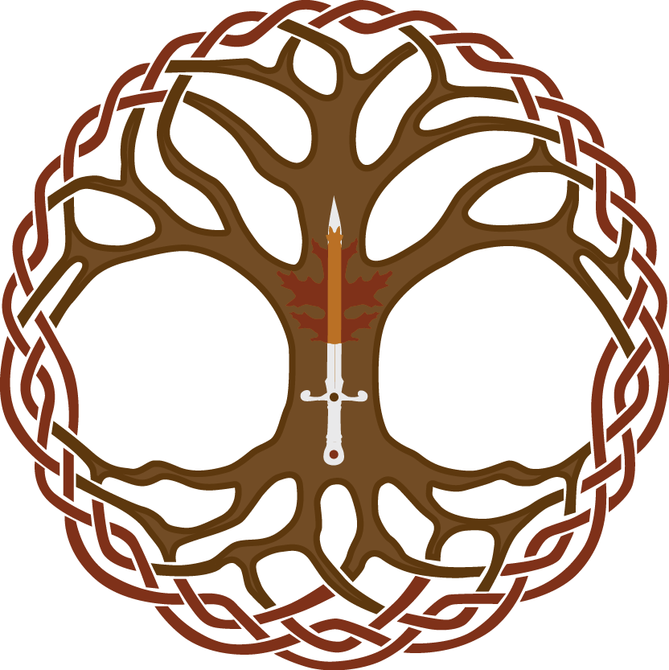

<section name="f532" class="section section--body section--first section--last">

<blockquote name="7e15" id="7e15" class="graf graf--blockquote graf-after--h3">One of our announcements has been postponed (likely tomorrow), but one of them can’t wait. This post is not about how to run a convention (sorry) but it’s about something close to our hearts, so we hope you’ll forgive the intermission.</blockquote>
Our <a href="https://EttinCon.org/world" data-href="https://EttinCon.org/world" class="markup--anchor markup--p-anchor" rel="noopener" target="_blank"><em class="markup--em markup--p-em">Worldbuilder</em> RPG setting</a> (a shared map where many different players can create, explore and affect a fantasy world) has had a number of updates, some still in progress, from the games people have played over the past year. A couple of generous patrons have added items or locations to the map by donating to us via Patreon or PayPal. Something else has been added recently, in the form of our very first storyline. Engaging with it is totally optional, up to the players and GMs, but it’s been added for an important reason, and that is to honour a neighbour we lost to cancer a year ago today.

Bryce was a wonderful guy. I’ll always regret not getting to know him better than the chats we had around local school or soccer games. He helped us get our piano into our house without a second’s hesitation. I’ve run games for one of his kids but didn’t quite manage to run something for him (we were scheduling it around the time he passed) and I wish I could’ve seen the characters he might’ve brought to the table. I can’t do much about any of these things now, but came up with something else.

I’d like to thank Bryce’s family for working with me on this, and a generous new player for engaging with it already. In our make-believe world, we’ve planted a forest of scarlet oak trees in reference to his family name. It’s the broadest wood we’re likely to see on our coast. From that forest, a number of elements are spiralling out, iconic buildings, magic items and personages I’ve included for his wife and kids, as well as references to the things he cared about and the way I saw him: a strong, gentle and kind man.

Some of this is on the wiki already, some of it is about to be added to the canvas map, and some of it is bubbling away in secret, but it’s part of our history now and I really look forward to what the story might hold in the future are players discover and interact with it. If you’d like to peek at what’s there so far, you can find it at <a href="https://ettincon.org/world/wiki/tag/Firebrand" data-href="https://ettincon.org/world/wiki/tag/Firebrand" class="markup--anchor markup--p-anchor" rel="nofollow noopener" target="_blank"><strong class="markup--strong markup--p-strong">EttinCon.org/world/wiki/tag/Firebrand</strong></a><strong class="markup--strong markup--p-strong">.</strong>

<figure name="ba60" id="ba60" class="graf graf--figure graf-after--p"><figcaption class="imageCaption"><a href="https://ettincon.org/world/wiki/tag/Firebrand" data-href="https://ettincon.org/world/wiki/tag/Firebrand" class="markup--anchor markup--figure-anchor" rel="nofollow noopener noopener" target="_blank">EttinCon.org/world/wiki/tag/Firebrand</a></figcaption></figure>

One of my slow-burning aims with Ettin Con (since accidentally starting the thing) has been to build and foster our community because our time is so precious, and we should spend as much of it as possible enjoying each other’s company. Personally, I love to spend that time playing games and telling stories (simultaneously wherever possible), as valid a pastime as playing music, or sport, or creating art, in giving us a way to be together, locals and visitors, young and old, existing friends and new acquaintances. I hope that 2018 is going to see a lot more attendees reaching out via various technological means (<em class="markup--em markup--p-em">more on this in coming weeks</em>) to strengthen these friendships, arranging meetings both within and without the convention, to make the most of the time that we have. People being people, we need to approach all of these efforts considering each other’s <a href="https://EttinCon.org/conduct" data-href="https://EttinCon.org/conduct" class="markup--anchor markup--p-anchor" rel="noopener" target="_blank">safety, privacy and consent</a>, but we hope that we can help you find a seat at a table when you need one, or someone to join yours, so that we can fill our days with more joy than regret. I hope you’ll help us with this.

<em class="markup--em markup--p-em">-Matt Horam, Con Org for </em><strong class="markup--strong markup--p-strong"><em class="markup--em markup--p-em">Ettin Con</em></strong><em class="markup--em markup--p-em">.</em>

</section>