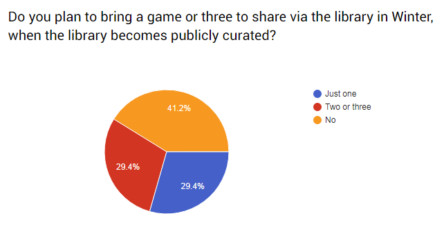
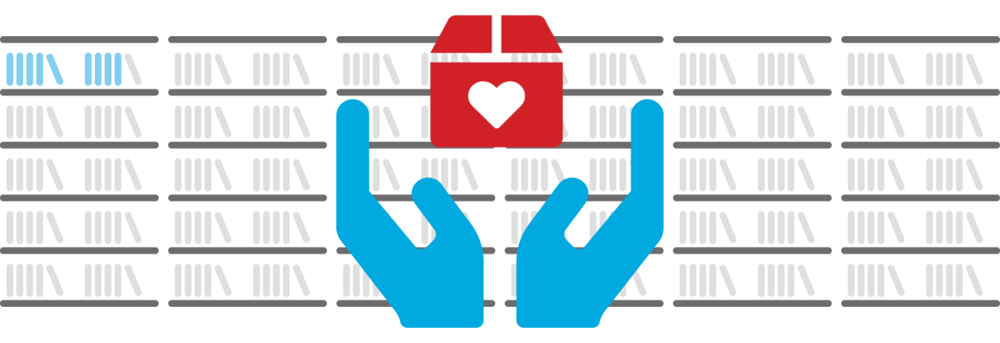

<section name="2145" class="section section--body section--first">

One of the biggest changes we’re facing for this event is that our primary sponsor (and supplier of the games library at previous events) closed down their physical shop and would be unlikely to have a library to provide as of Winter 2018. We’ve always wanted people to bring their own games to share, but this is the first time we’ve actually needed them to in order for the library to function. It’s just about bringing one or more games to share and then taking them home again, which is so much better than a huge collection sitting around in someone’s house, unused between events.

Laying the ground-work for this involved warning everyone leading up to our Summer event to lessen the shock. Next, we included a question on our feedback survey to simultaneously inform and gauge participation levels:

<figure name="e384" id="e384" class="graf graf--figure graf-after--p"><figcaption class="imageCaption">Even with a small number of respondents, we have something to work from.</figcaption></figure>

Extrapolating from the survey on the assumption that the medium-to-best scenario would see a similar level of library contributions this August, and if attendance was similar (250–300 people) the above numbers would shake out at an average of one game per person (<em class="markup--em markup--p-em">ask to see my spreadsheets if you’re a sadist</em>). This is a desirable result for many reasons, not least among them the notion that knowing a game belongs to an individual or family (rather than a business) should see a higher level of respect and care shown by the borrowers. We’ve never had a huge problem here, but as numbers have grown, it’s pretty normal to see a larger statistic of wear and tear from haste, youthful exuberance, or the bitter-sweet naievety of new gamers. If it reached a more significant level, we would need to introduce either a bond for borrowers, a library usage fee (like <a href="http://www.cgs.asn.au/Cancon/board-games-library/" data-href="http://www.cgs.asn.au/Cancon/board-games-library/" class="markup--anchor markup--p-anchor" rel="noopener" target="_blank"><em class="markup--em markup--p-em">CanCon</em></a>) or simply increase ticket prices to absorb the cost of replacements.
<blockquote name="698c" id="698c" class="graf graf--blockquote graf-after--p">To be clear: we want to welcome all people to enjoy the day with us, and consider it our mission. We’ll try to keep costs down but will never gate-keep our event/hobby against the inexperienced.</blockquote>
This week, the drive to get library contributions begins in earnest. We currently have a handful of games donated by volunteer staff or sponsors and a few games on loan from staff or attendees, but there’s a long way to go to reach our familiar levels. Illustrated by the blue/grey on our slideshow image:

<figure name="fd5d" id="fd5d" class="graf graf--figure graf-after--p"><figcaption class="imageCaption">Visit <a href="https://EttinCon.org/library/lend.php" data-href="https://EttinCon.org/library/lend.php" class="markup--anchor markup--figure-anchor" rel="nofollow noopener" target="_blank">https://EttinCon.org/library/lend.php</a> to add your game(s)!</figcaption></figure>

We’ve set up a GeekList on <em class="markup--em markup--p-em">Board Game Geek</em> as a really easy way to manage the library catalogue. If someone intends to bring a game, they just <a href="https://EttinCon.org/library/lend.php" data-href="https://EttinCon.org/library/lend.php" class="markup--anchor markup--p-anchor" rel="noopener" target="_blank">log into BGG via https://EttinCon.org/library/lend.php</a> and add it to the list from their extensive database. We download our list, along with pre-purchased ticketholders, then upload it to our new library software for ease of printing library cards and scanning barcodes. Everything is logged for accountability and we’ll have more time to check each game in and out, so attendees have more time to play them!

</section><section name="ae1f" class="section section--body">

<h3 name="9041" id="9041" class="graf graf--h3 graf--leading">Next Task: T-Shirt Pre-Orders</h3>

<figure name="b481" id="b481" class="graf graf--figure graf-after--h3"></figure>

We’ve finally completed our new T-Shirt design and are opening pre-orders soon. This will allow people to tell us which sizes they need before we organise the print run. The shirts will be available for collection (along with spares to sell) at the event, to eliminate postage costs and reduce handling. As always, any profits from merchandise sales go straight back into our <em class="markup--em markup--p-em">Event Improvement Fund</em>, which we should probably detail in a future blog post, now that I think of it…

<em class="markup--em markup--p-em">-Matt Horam, Con Org for </em><strong class="markup--strong markup--p-strong"><em class="markup--em markup--p-em">Ettin Con</em></strong><em class="markup--em markup--p-em">.</em>

</section><section name="a4e4" class="section section--body section--last">

<blockquote name="b256" id="b256" class="graf graf--blockquote graf--leading graf--trailing">Do you have a topic you’d like to see covered in future posts? Let me know via email: <a href="mailto:admin@EttinCon.org" data-href="mailto:admin@EttinCon.org" class="markup--anchor markup--blockquote-anchor" target="_blank">admin@EttinCon.org</a></blockquote>

</section>