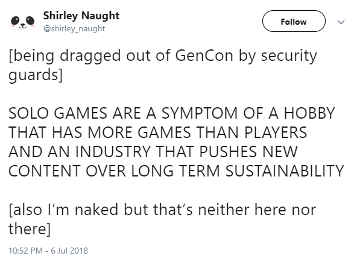

<h1 class="p-name"></h1>

<section name="3525" class="section section--body section--first">

Since <a href="https://medium.com/ettincon/friday-round-up-6th-july-2018-e8c74baefec9" data-href="https://medium.com/ettincon/friday-round-up-6th-july-2018-e8c74baefec9" class="markup--anchor markup--p-anchor" target="_blank">last week’s post</a> about free/interesting games in my mind that week, a few more have drifted past. Let’s see if I can remember them all without opining too much!
<h4 name="3923" id="3923" class="graf graf--h4 graf-after--p">Free Games</h4><ul class="postList"><li name="3f7a" id="3f7a" class="graf graf--li graf-after--h4">Local <strong class="markup--strong markup--li-strong">Steve Dee</strong> has some <a href="http://tinstargames.weebly.com/games-for-free.html" data-href="http://tinstargames.weebly.com/games-for-free.html" class="markup--anchor markup--li-anchor" rel="noopener" target="_blank">free games on the Tin Star website</a>, plus more available to purchase. As I type, his <a href="https://imgur.com/gallery/mTzrTky" data-href="https://imgur.com/gallery/mTzrTky" class="markup--anchor markup--li-anchor" rel="noopener" target="_blank">party game about Elon’s Submarine</a> is whipping across the internet to a good share of laughs, which is cool to see.</li><li name="54dd" id="54dd" class="graf graf--li graf-after--li">Until Monday, <a href="http://www.drivethrurpg.com/product/118932/1er--The-Outlaw-Motorcycle-Game" data-href="http://www.drivethrurpg.com/product/118932/1er--The-Outlaw-Motorcycle-Game" class="markup--anchor markup--li-anchor" rel="noopener" target="_blank"><strong class="markup--strong markup--li-strong">Sons of Anarchy fans can get the best RPG for them</strong></a>, 1%er (“One Percent-er”) for the price of their choosing.</li><li name="399d" id="399d" class="graf graf--li graf-after--li">One of <strong class="markup--strong markup--li-strong">Ben Lehman</strong>’s games fell into my feed this week, and I know some people might feel strange about rules which read like “do this until you feel you don’t want to anymore” but every game has that rule, it’s just seldom written into the fiction like this. <a href="http://www.tao-games.com/beloved" data-href="http://www.tao-games.com/beloved" class="markup--anchor markup--li-anchor" rel="noopener" target="_blank"><strong class="markup--strong markup--li-strong">Beloved</strong></a> is a game about saving your prince/princess/princex from monstrous captivity, like some leaping plumber. There are plenty of other cool things to be found on that site, too!</li><li name="e214" id="e214" class="graf graf--li graf-after--li">I just remembered about <a href="https://sandypuggames.itch.io/mirror-a-micro-rpg" data-href="https://sandypuggames.itch.io/mirror-a-micro-rpg" class="markup--anchor markup--li-anchor" rel="noopener" target="_blank"><strong class="markup--strong markup--li-strong">Mirror</strong></a> from Sandy Pug Games, which is about observation, among other things.</li><li name="549d" id="549d" class="graf graf--li graf-after--li"><a href="http://www.drivethrurpg.com/product/234653/Dead-Friend-A-Game-of-Necromancy" data-href="http://www.drivethrurpg.com/product/234653/Dead-Friend-A-Game-of-Necromancy" class="markup--anchor markup--li-anchor" rel="noopener" target="_blank"><strong class="markup--strong markup--li-strong">Dead Friend</strong></a> is a very cool <em class="markup--em markup--li-em">Pay-What-You-Want</em> two-player RPG, but PWYW translates best as “download it, read it, like it, PLEASE buy it” and if you can pay something for this one, it’s really worth it. It stirred similar emotions to <a href="http://ascoundrelinthedeep.com" data-href="http://ascoundrelinthedeep.com" class="markup--anchor markup--li-anchor" rel="noopener" target="_blank"><em class="markup--em markup--li-em">A Scoundrel in the Deep</em></a>, but MORESO.</li><li name="a006" id="a006" class="graf graf--li graf-after--li"><a href="https://boardgamegeek.com/boardgame/162292/draugr/files" data-href="https://boardgamegeek.com/boardgame/162292/draugr/files" class="markup--anchor markup--li-anchor" rel="noopener" target="_blank"><strong class="markup--strong markup--li-strong">The Draugr</strong></a> is a print-and-play solo game which looks great and well-rated. There are so many good solo p’n’p games out there at the moment, I (unfairly) feel disappointed by the fact that they don’t address my main quest to <em class="markup--em markup--li-em">get people playing together</em>.</li></ul>

<figure name="d233" id="d233" class="graf graf--figure graf-after--li"><figcaption class="imageCaption"><a href="https://twitter.com/shirley_naught/status/1015216971221045248" data-href="https://twitter.com/shirley_naught/status/1015216971221045248" class="markup--anchor markup--figure-anchor" rel="nofollow noopener" target="_blank">https://twitter.com/shirley_naught/status/1015216971221045248</a></figcaption></figure>

<h4 name="e044" id="e044" class="graf graf--h4 graf-after--figure">Kickstarters &amp; Other Commercial Games</h4><ul class="postList"><li name="a7c7" id="a7c7" class="graf graf--li graf-after--h4">An Australian designer is kickstarting <a href="https://www.kickstarter.com/projects/jennsandercock/edible-games-cookbook-play-with-your-food" data-href="https://www.kickstarter.com/projects/jennsandercock/edible-games-cookbook-play-with-your-food" class="markup--anchor markup--li-anchor" rel="noopener" target="_blank"><strong class="markup--strong markup--li-strong">a cookbook of edible games</strong></a>, which is an intriguing concept.</li><li name="2ced" id="2ced" class="graf graf--li graf-after--li">When <a href="https://www.kickstarter.com/projects/1549920133/quickstarter-harder-they-fall" data-href="https://www.kickstarter.com/projects/1549920133/quickstarter-harder-they-fall" class="markup--anchor markup--li-anchor" rel="noopener" target="_blank"><strong class="markup--strong markup--li-strong">this Quickstarter campaign</strong></a> said their game used dominoes as a mechanic, I assumed they were <a href="https://boardgamegeek.com/thread/1021123/using-dominoes-dice-rolls" data-href="https://boardgamegeek.com/thread/1021123/using-dominoes-dice-rolls" class="markup--anchor markup--li-anchor" rel="noopener" target="_blank">a stand-in for rolling 2d6</a>, but instead, you actually topple them to resolve mech battles!</li></ul>
Anyway, that’s all I have time for this week, there are heaps of other things I should be getting on with!

<em class="markup--em markup--p-em">-Matt Horam, Con Org for </em><strong class="markup--strong markup--p-strong"><em class="markup--em markup--p-em">Ettin Con</em></strong><em class="markup--em markup--p-em">.</em>

</section><section name="a4e4" class="section section--body section--last">

<blockquote name="b256" id="b256" class="graf graf--blockquote graf--leading graf--trailing">Have you discovered something cool lately? Share it with us via email: <a href="mailto:admin@ettincon.org" data-href="mailto:admin@ettincon.org" class="markup--anchor markup--blockquote-anchor" target="_blank">admin@ettincon.org</a>!</blockquote>

</section>