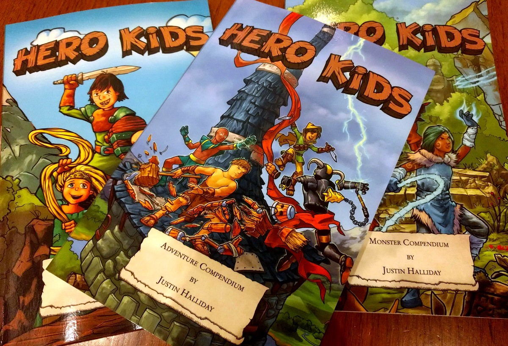
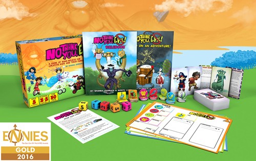
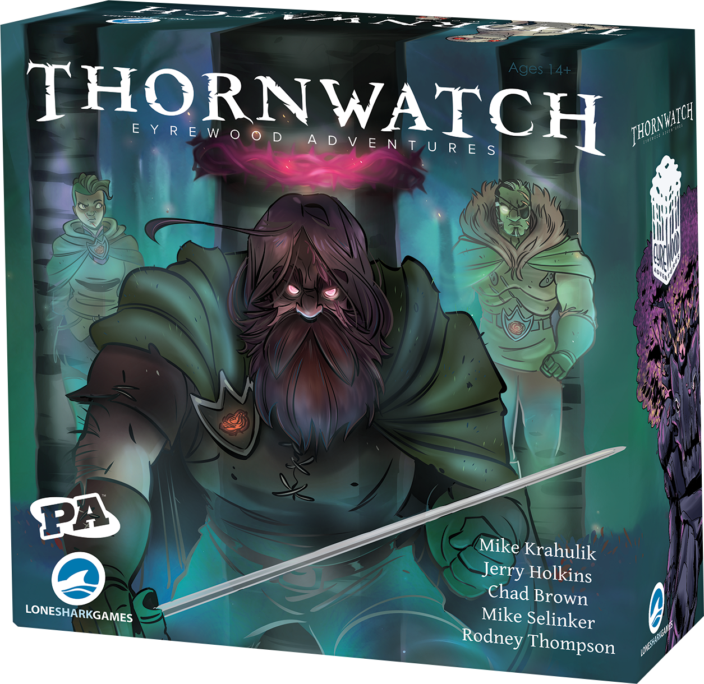
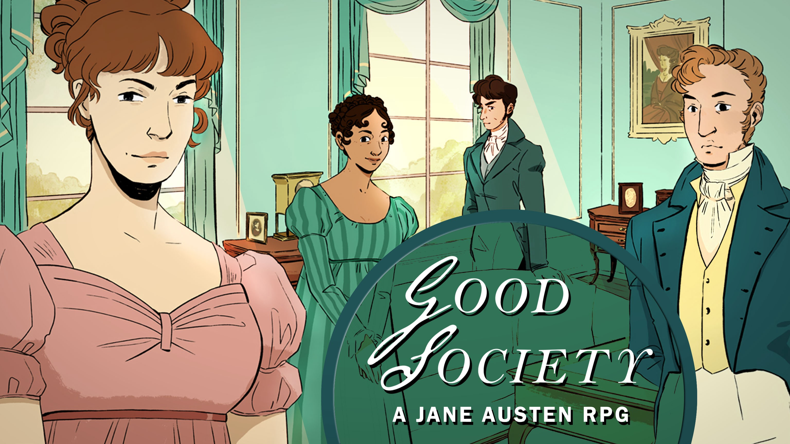

<section name="d8d1" class="section section--body section--first">

<blockquote name="87c9" id="87c9" class="graf graf--blockquote graf-after--h3">On the weekend, I heard about a 15yo who met someone at Ettin Con and is now part of their weekly Dungeons &amp; Dragons group in Katoomba. This lead to a conversation with their science teacher and now they’re playtesting the teacher’s own system at lunchtimes - these stories make me very happy, &amp; coincide with a bit of a focus for the convention next year.</blockquote>
Over the years, we’ve been using small amounts of event proceeds (and now <a href="https://Patreon.com/EttinCon" data-href="https://Patreon.com/EttinCon" class="markup--anchor markup--p-anchor" rel="noopener" target="_blank">Patreon</a> proceeds) to purchase library games and resources, either through Kickstarter, distributors, or local shops. Board games are one side of this (and the majority of our table space), but our convention was originally driven by a love of role-playing games, and we are always looking at how we can support that side of the tabletop gaming hobby. Today’s post is mostly about providing physical resources, but also touches on how we’d like to help people learn, teach and organise RPG sessions both within &amp; without our events.

<figure name="b34a" id="b34a" class="graf graf--figure graf-after--p"><figcaption class="imageCaption">Home-grown Gaming Goodness</figcaption></figure>

Local designer <em class="markup--em markup--p-em">Justin Halliday</em> donated a copy of his <a href="http://herokidsrpg.blogspot.com" data-href="http://herokidsrpg.blogspot.com" class="markup--anchor markup--p-anchor" rel="noopener" target="_blank">Hero Kids RPG</a> to us early on, both in softcover &amp; a bundle of PDFs to round it out with adventures. You can borrow the core softcovers from our library at each event, and if you’re planning a session ahead of time, we can provide PDF access to adventures, plus a small amount of printing in conjunction with that commitment. It’s a simple system designed specifically to introduce young kids (ages 4–10) to the basics of rolling dice and being heroes in a fantasy setting. Over the course of 2019, we hope to have a few more kid-centric games available, already downloaded (both free and purchased), awaiting either printing or delivery in coming months. <a href="https://amazing-tales.net" data-href="https://amazing-tales.net" class="markup--anchor markup--p-anchor" rel="noopener" target="_blank">Amazing Tales</a> (we picked it up on sale for $2.99) is another streamlined storytelling system headed to the library.

<figure name="0815" id="0815" class="graf graf--figure graf-after--p"><figcaption class="imageCaption">Boxed sets are so great.</figcaption></figure>

Two copies of <a href="http://www.nothankyouevil.com" data-href="http://www.nothankyouevil.com" class="markup--anchor markup--p-anchor" rel="noopener" target="_blank">No Thank You, Evil!</a> (plus supplementary materials) are on their way to us, one for the library &amp; one for a future raffle prize. It’s a system for players aged 5 and up, and tailors to three levels of complexity so that older kids and parents can still be interested when playing alongside younger kids learning the ropes. It also gives the younger ones something to aspire toward!

<figure name="22be" id="22be" class="graf graf--figure graf-after--p"><figcaption class="imageCaption">Broody Glare &amp; the Mysterious Figures, touring soon</figcaption></figure>

Any moment now, our library copy of <a href="http://eyrewoodadventures.com" data-href="http://eyrewoodadventures.com" class="markup--anchor markup--p-anchor" rel="noopener" target="_blank">Thornwatch</a> should be arriving. This is a card-driven RPG which bridges the gap between traditional RPGs and modern board games - so it’s as good a place to dip your toe as any - mixing a comic-art-panel play area with icon dice and character cards, you won’t need a pencil or eraser to track your abilities, combat order or injuries.

<figure name="416f" id="416f" class="graf graf--figure graf-after--p"><figcaption class="imageCaption">*Politeness Intensifies*</figcaption></figure>

Local Luminaries Hayley and Vee from <a href="https://storybrewersroleplaying.com" data-href="https://storybrewersroleplaying.com" class="markup--anchor markup--p-anchor" rel="noopener" target="_blank">Storybrewers Roleplaying</a> completed their amazing second kickstarter, this time for <a href="https://storybrewersroleplaying.com/good-society/" data-href="https://storybrewersroleplaying.com/good-society/" class="markup--anchor markup--p-anchor" rel="noopener" target="_blank">Good Society</a>, a more developed version of the first game they ever ran at Ettin Con. It’s a Jane Austen RPG with two cool expansions, and we backed a hardcover copy for the library, partly out of the reward budget we use to compensate GMs like them for their time donated to running games - we figured the best way to reward them was to help them print this lovely game, and get it into your hands.

In addition to the games mentioned above, as many free games as we can print for the self-service table, boxes of pencils, erasers &amp; scrap paper, we have something special for anyone running fantasy RPGs for kids (or at least characters who are kids) - a full set of <a href="https://wizkids.com/wardlings-w1/" data-href="https://wizkids.com/wardlings-w1/" class="markup--anchor markup--p-anchor" rel="noopener" target="_blank">Wardlings</a> miniatures you can borrow for a session (or more). There are six classes available, <a href="https://wizkids.com/wardlings-w2/" data-href="https://wizkids.com/wardlings-w2/" class="markup--anchor markup--p-anchor" rel="noopener" target="_blank">two variants</a> of each (loosely gender-based but easy to gloss over) and each variant has a miniature to represent a pet or spirit companion. I used the first six of these to run a session last Winter, and am planning more for next Winter, but we’d love to see these used, either for D&amp;D, Hero Kids, or anything else! I was using a second iteration of a custom ruleset for all ages, and the third iteration looks promising to release for others to use next year.

We’re not intending to increase the number of RPG tables or spaces at this point (noise is our biggest obstacle there) but growing the hobby as a whole (across ages, genders, and every other existential spectrum) is my personal project since before Ettin Con began. The goal of running some conventions across two days in the future should be sufficient, I hope!

In terms of getting people together, we’re still holding out hope that between <a href="https://www.facebook.com/groups/124703461483087/?source_id=282261045280762" data-href="https://www.facebook.com/groups/124703461483087/?source_id=282261045280762" class="markup--anchor markup--p-anchor" rel="noopener" target="_blank">social media communities</a>, alongside <a href="https://invite.gg/EttinCon" data-href="https://invite.gg/EttinCon" class="markup--anchor markup--p-anchor" rel="noopener" target="_blank">Discord </a>and <a href="https://www.iamgamefor.com" data-href="https://www.iamgamefor.com" class="markup--anchor markup--p-anchor" rel="noopener" target="_blank">GameFor</a>, we can be a hub through which more gamers meet each other and have more fun (and friends) in their lives. If you’re interested in learning a system, or teaching it, it’s only a matter of asking in any of these spaces, or if you’re shy, send us an email and we’ll be happy to act as your proxy.
<blockquote name="5c2d" id="5c2d" class="graf graf--blockquote graf-after--p graf--trailing">If you have any ideas about supporting RPGs at Ettin Con, please send us an email via <a href="mailto:info@ettincon.org" data-href="mailto:info@ettincon.org" class="markup--anchor markup--blockquote-anchor" target="_blank">info@EttinCon.org</a>, we’d love to hear from you!</blockquote>

</section><section name="ea90" class="section section--body section--last">

<em class="markup--em markup--p-em">-Matt Horam, Con Org for Ettin Con </em><a href="mailto:info@EttinCon.org" data-href="mailto:info@EttinCon.org" class="markup--anchor markup--p-anchor" target="_blank"><em class="markup--em markup--p-em">info@EttinCon.org</em></a>

</section>