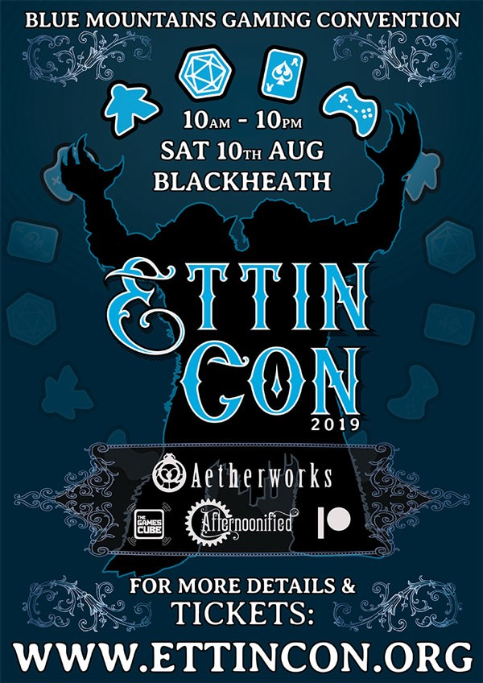

<section name="2a96" class="section section--body section--first">

<blockquote name="16d0" id="16d0" class="graf graf--blockquote graf-after--h3">Announcements made, <a href="https://EttinCon.org/#tickets" data-href="https://EttinCon.org/#tickets" class="markup--anchor markup--blockquote-anchor" rel="noopener" target="_blank"><strong class="markup--strong markup--blockquote-strong">tickets on sale</strong></a>, planning in progress. This is a nice way to start the year!</blockquote>

<figure name="1d9e" id="1d9e" class="graf graf--figure graf-after--blockquote"><figcaption class="imageCaption">Ettin Con 2019 Winter poster</figcaption></figure>

I’ll need to send that poster off to print soon, so that we have plenty of flyers over the next thirty weeks. Oh, and before I forget, I was lucky enough to be invited on the <a href="http://insertquesthere.com/2018/12/iqh-presents-convention-chats/" data-href="http://insertquesthere.com/2018/12/iqh-presents-convention-chats/" class="markup--anchor markup--p-anchor" rel="noopener" target="_blank">Insert Quest Here</a> podcast to chat with Ray (<a href="https://www.newconoz.com/" data-href="https://www.newconoz.com/" class="markup--anchor markup--p-anchor" rel="noopener" target="_blank"><em class="markup--em markup--p-em">NewConOz</em></a><em class="markup--em markup--p-em">) </em>and Hayley (<a href="https://www.arcanacon.org/" data-href="https://www.arcanacon.org/" class="markup--anchor markup--p-anchor" rel="noopener" target="_blank">ArcanaCon</a>) about Con Org Stuff: <a href="http://insertquesthere.com/2018/12/iqh-presents-convention-chats/" data-href="http://insertquesthere.com/2018/12/iqh-presents-convention-chats/" class="markup--anchor markup--p-anchor" rel="nofollow noopener" target="_blank">insertquesthere.com/2018/12/iqh-presents-convention-chats/</a> - many thanks to Hayley &amp; Ray for your time, thoughts, and audiences!
<blockquote name="fec9" id="fec9" class="graf graf--blockquote graf-after--p graf--trailing">This week, I’d like to talk about what I’m trying to achieve in our preliminary planning for the event, and some of the ideas in the back of my mind, whether or not they come to fruition this year, or at all.</blockquote>

</section><section name="34a7" class="section section--body">

As much as I wanted to achieve a two-day event this year, I’m feeling very lucky that we were able to choose a date which [a] didn’t directly clash with any announced conventions (although I would’ve preferred to give <a href="https://www.newconoz.com/" data-href="https://www.newconoz.com/" class="markup--anchor markup--p-anchor" rel="noopener" target="_blank"><em class="markup--em markup--p-em">NewConOz</em></a> more room, if I’d realised they were eyeing the weekend after us), [b] suited not only <a href="http://www.aetherworks.com.au/" data-href="http://www.aetherworks.com.au/" class="markup--anchor markup--p-anchor" rel="noopener" target="_blank"><em class="markup--em markup--p-em">Aetherworks</em></a><em class="markup--em markup--p-em"> </em>(who had reached out to offer various ideas of how they could contribute), but also suited [c] <a href="http://www.thegamescube.com" data-href="http://www.thegamescube.com" class="markup--anchor markup--p-anchor" rel="noopener" target="_blank"><em class="markup--em markup--p-em">The Games Cube</em></a>, who can see the triumphant return of a Magic tourney, which was missed at our last event. Having something to work towards, knowing something is going to happen, is uplifting.

To address our greatest challenge of staff levels, both in planning and running the event, we’re having a private <em class="markup--em markup--p-em">Plan-and-Play</em> event (including our games library) later this month for anyone committing to one or both of those abovementioned capacities. It will temporarily supplant our Summer event, though smaller in scale, with three hours of planning, brainstorming, and voluntary delegation, followed by three hours of gameplay and socialising. It will be so nice to dedicate some time to these ideas, have interested parties distribute the workload, contribute to the structure of the event, and get to know each other around the table. If you want in, and agree to the terms outlined in this paragraph, please visit <a href="https://EttinCon.org/volunteer" data-href="https://EttinCon.org/volunteer" class="markup--anchor markup--p-anchor" rel="noopener" target="_blank"><strong class="markup--strong markup--p-strong">EttinCon.org/volunteer</strong></a>, <em class="markup--em markup--p-em">sending us an email before 15/01/2019</em> so we can give you access to the details.

Lots of people have expressed interest and I’m hoping most of them can make it to the meeting. I’m still trying to figure out the most efficient way to use our three hours for planning, but I have drafted an idealised staff plan for us to work towards in terms of recruitment. If we can get 50–75% of those spots allocated before August, we’ll be in great shape. We’ve run with less before, but I’m aiming higher this time. At the very least, it’s great to be talking to so many people about the building the event, and hearing their enthusiastic responses! I’m really interested in seeing what improvements could be made to our processes across the board, from promotional avenues to the moment-to-moment intricacies of the event on the day.

My ideal (as I babbled about in Ray’s podcast) is to have at least two staff at every station at any given moment, so that even when they are working a shift, they have company (and possibly a playmate) to chat and/or game with, especially during quiet moments. I usually push pretty hard for this, but we have more time (and more hands) to work towards it this time.

I’ve been thinking about competitions or challenges for prizes or accolades - effectively achievements in general, for attendees of all kinds. We already run the <a href="https://EttinCon.org/team" data-href="https://EttinCon.org/team" class="markup--anchor markup--p-anchor" rel="noopener" target="_blank"><em class="markup--em markup--p-em">Team Player</em></a> program to encourage and reward a variety of fun and supportive activities, and role-playing GMs have a ranked <a href="https://EttinCon.org/GM/leaderboard" data-href="https://EttinCon.org/GM/leaderboard" class="markup--anchor markup--p-anchor" rel="noopener" target="_blank">leaderboard</a> alongside their tiered rewards, the latter being based on our usual biannual model, which isn’t available to us this calendar year. If GMs have half the opportunities as we usually provide, how does that affect their rank/reward? Should we just cut the thresholds in half, or invent new types of supplementary achievements for them to unlock?

Further to this, what about special events or challenges centred around certain concepts? We could have a prize-winning tournament (or maybe just some exclusive <a href="https://EttinCon.org/team" data-href="https://EttinCon.org/team" class="markup--anchor markup--p-anchor" rel="noopener" target="_blank"><em class="markup--em markup--p-em">Team Player</em></a> badges) designed around a marathon of three or four games which are either thematically or mechanically adjacent. A <em class="markup--em markup--p-em">dexathlon </em>of dexterity-based games, for example, for nimble players.

Other ideas we’ve considered including, but never formally implemented include:
<ul class="postList"><li name="81fb" id="81fb" class="graf graf--li graf-after--p">Artist alley/flea market/swap-meet tables</li><li name="d846" id="d846" class="graf graf--li graf-after--li">Role-playing “games on demand”  (as seen in <a href="http://www.indiegamesondemand.org/" data-href="http://www.indiegamesondemand.org/" class="markup--anchor markup--li-anchor" rel="noopener" target="_blank">many conventions across the water</a>)</li><li name="9cdf" id="9cdf" class="graf graf--li graf-after--li">Workshops and Discussion Panels where people can share their learnings about gameplay, game design, and any adjacent industry, play, design, craft, health, or social topics.</li><li name="4197" id="4197" class="graf graf--li graf-after--li">LARP (either indoor, less-physical live-action role-playing games like <a href="https://www.kickstarter.com/projects/burningwheel/inheritance-0" data-href="https://www.kickstarter.com/projects/burningwheel/inheritance-0" class="markup--anchor markup--li-anchor" rel="noopener" target="_blank"><em class="markup--em markup--li-em">Inheritance</em></a> or outdoor, physically intensive ones, the latter obviously involving safety and liability concerns)</li><li name="0864" id="0864" class="graf graf--li graf-after--li">Multi-table mega-games, like <a href="https://www.drivethrurpg.com/product/248012/Aegons-Conquest-MegaGame" data-href="https://www.drivethrurpg.com/product/248012/Aegons-Conquest-MegaGame" class="markup--anchor markup--li-anchor" rel="noopener" target="_blank"><em class="markup--em markup--li-em">Aegon’s Conquest</em></a> or <a href="http://www.godemperor.net/" data-href="http://www.godemperor.net/" class="markup--anchor markup--li-anchor" rel="noopener" target="_blank"><em class="markup--em markup--li-em">God Emperor</em></a><em class="markup--em markup--li-em">. </em>(We’re currently running at a 50% success rate for running multi-table games, one secured the minimum players in 2016, one in 2018 did not)</li></ul><blockquote name="90ad" id="90ad" class="graf graf--blockquote graf-after--li graf--trailing">Do you have any ideas to contribute to our convention? Please tweet them to us <a href="http://twitter.com/EttinCon" data-href="http://twitter.com/EttinCon" class="markup--anchor markup--blockquote-anchor" rel="noopener" target="_blank">@EttinCon</a> or email them through to <a href="mailto://info@EttinCon.org" data-href="mailto://info@EttinCon.org" class="markup--anchor markup--blockquote-anchor" rel="noopener" target="_blank">info@EttinCon.org</a> - we’d love to hear them, and if we use them we’ll ensure everyone is informed that you were the catalyst for their inclusion.</blockquote>

</section><section name="0ad4" class="section section--body section--last">

<em class="markup--em markup--p-em">-Matt Horam, Con Org for Ettin Con </em><a href="mailto:info@EttinCon.org" data-href="mailto:info@EttinCon.org" class="markup--anchor markup--p-anchor" target="_blank"><em class="markup--em markup--p-em">info@EttinCon.org</em></a>

</section>