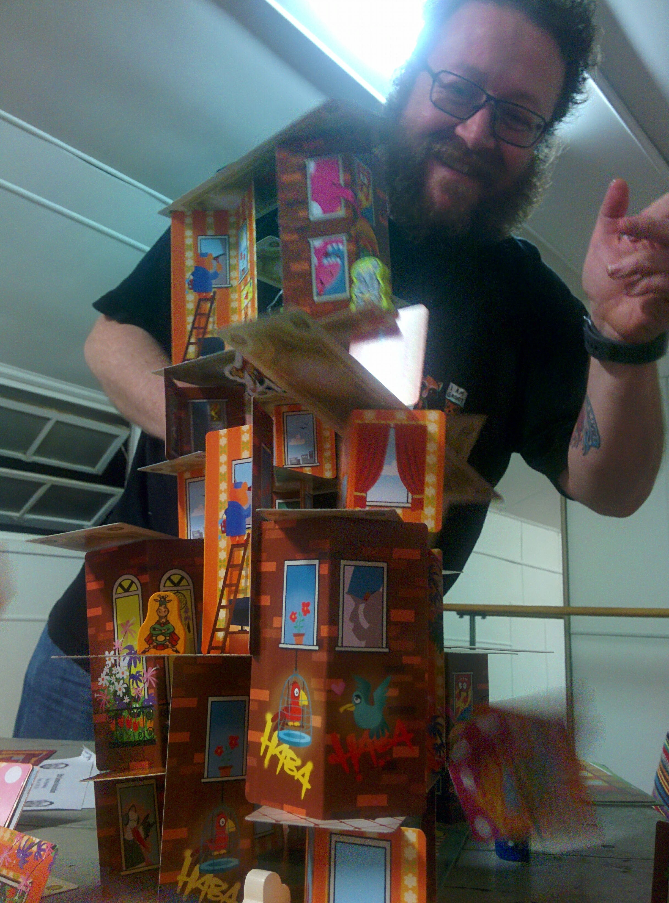

<section name="c029" class="section section--body section--first">

<blockquote name="82db" id="82db" class="graf graf--blockquote graf-after--h3">Woke up this morning with things in my head besides potential blues lyrics. Today, I’m going to share my perspective on the Plan &amp; Play meeting, and some of the things which will happen, are happening, and have happened. Come along with me!</blockquote>
The Plan and Play meeting on Jan 20th was intended to lure potential organisers &amp; staff into three hours of convention planning &amp; delegation, followed by three hours of games! In a small, cheap hall, hired for the same duration as Winter 2015, it would occupy the vacuum left by the lack of a Summer 2019 event. I arrived a little late, rushed, scattered, and once again prepared more for what I hoped would happen than what was likely to happen. That’s okay! It’s got us this far.

I need to say that the numbers were overwhelming. I’m all out of whelm. We had seventeen people there willing to share ideas for 2019 and 2020, and it’s inevitable in these sorts of things to spend a bit of time sharing information about what we’ve considered or explored before, and why those things may or may not be worth pursuing afresh. Sadly, due to illness and other commitments, our numbers thinned a bit by the point of playing, but PLAY WE DID.

There were several rounds of <a href="https://bloodontheclocktower.com" data-href="https://bloodontheclocktower.com" class="markup--anchor markup--p-anchor" rel="noopener" target="_blank">Blood on the Clocktower</a>, including some first-timer teen storytellers, and after much coaxing, I finally relented and joined for a round. I was the Imp, and I employed the famous noob bluff of <em class="markup--em markup--p-em">Terrifyingly Having No Idea What I Am Doing In This Game</em> to distract people with the actual truth that I had no clue what to do. My son was the Spy, and we slaughtered the entire village. Lucky!

He and I also joined some first-timers for <a href="https://www.illimat.com" data-href="https://www.illimat.com" class="markup--anchor markup--p-anchor" rel="noopener" target="_blank">Illimat</a>, and I felt really bad for winning, so please know that was lurking behind the winner’s grin. I love Illimat but usually avoid competitive games in favour of collaborative ones, so that’s probably a good thing for everyone. <a href="https://boardgamegeek.com/boardgame/218333/rhino-hero-super-battle" data-href="https://boardgamegeek.com/boardgame/218333/rhino-hero-super-battle" class="markup--anchor markup--p-anchor" rel="noopener" target="_blank">Rhino Hero Super Battle</a> came out and when I tried to photograph our tall building, I accidentally captured the moment it started to topple:

  
<figure name="e508" id="e508" class="graf graf--figure graf-after--p"><figcaption class="imageCaption">rhiNoooooooooo!</figcaption></figure>

I didn’t see everything which people played, but I overheard some <a href="http://slugfestgames.com/games/rdi/rdi-2/" data-href="http://slugfestgames.com/games/rdi/rdi-2/" class="markup--anchor markup--p-anchor" rel="noopener" target="_blank">Red Dragon Inn 2</a>, noticed some <a href="https://boardgamegeek.com/boardgame/165722/klask" data-href="https://boardgamegeek.com/boardgame/165722/klask" class="markup--anchor markup--p-anchor" rel="noopener" target="_blank">Klask</a> in the background, and had my first session of <strong class="markup--strong markup--p-strong">Instant RPG</strong>, which really helped me get my head around the approach for editing the rules. That one’s going to be released for free, probably by August, and I’m confident we’ll see some fun demonstration sessions in the main hall. The accessibility and portability of that RPG could only be beaten if it were also produced in audio/braille editions, but give us some time and I’ll look into it. Great gateway to stories with friends. More soon.

Before all that went down, we had a juggling brainstorm of stuff, and lots of it was useful/timely. Some delegation went down (posters and flyer distro, vendor relations) and we even squeezed in an AGM, followed by some new member signups! We have the 2019 skeleton staff already, plus enough interested parties to almost get that to the happy medium staff level of 30. We talked about why that really needs to go up to 40, so more recruitment is needed. <a href="https://EttinCon.org/volunteer" data-href="https://EttinCon.org/volunteer" class="markup--anchor markup--p-anchor" rel="noopener" target="_blank">Join us if you like!</a>
<blockquote name="ce2c" id="ce2c" class="graf graf--blockquote graf--hasDropCapModel graf-after--p">Oh, and pitches have started coming in, so we can start building the timetable as those pile up and vendor activities are confirmed. Someone even asked us for an audio promo suitable for podcasts, which made me wonder “<em class="markup--em markup--blockquote-em">If #EttinCon were a genre of background music, what would it sound like?</em>”</blockquote>
The big task, post meeting, is to stimulate online discussion and action around the topics which interested people. I’ll do my best to create discussion groups and spark things, but I’m really dreaming of seeing more initiative being taken to ask questions and suggest actions without me — it could happen!

Speaking of dreams, I had my traditional pre-event nightmare this morning, which prompted this blog post. It followed the usual theme of <em class="markup--em markup--p-em">The Event is Here and Everything is Wrong and It’s Too Late to Fix It</em>, but there was a fun twist at the end, for a change. Fun for an anxiety nightmare, anyway.

It goes like this:
<blockquote name="19ef" id="19ef" class="graf graf--blockquote graf-after--p">#EttinCon #Winter2019 was in full swing, with people everywhere. Actually, way more people that possible, so I should’ve realised it was a dream, thanks for deceiving me, brain. Someone saw me tidying up a loose copy of Hero Quest and asked if I needed a drink, and then I hurried off to check on the extra hall for RPGs. It was a mess, tables scattered everywhere and not set up, one group playing and the rest of the room was empty. I noticed that I hadn’t arranged table signage, and started to freak out. People started helping with the tables, so I moved off towards the open doors to the <em class="markup--em markup--blockquote-em">gymnasium</em>, which doesn’t exist in the real world, thanks, brain. People had wandered into the gym and triggered a security alarm across the whole venue. People were understandably cross. I asked the gym people to move along, and then checked the i<em class="markup--em markup--blockquote-em">maginary ampitheatre</em>. It was full of people, too! I asked them to please leave and as some of them did, someone informed me that they were waiting to see a charity screening of a film, so I was messing with someone else’s event! Lunacy.</blockquote><blockquote name="7cf4" id="7cf4" class="graf graf--blockquote graf-after--blockquote">I hurried back to the main hall to deactivate the alarm, and noticed only one person staffing the front door! I realised that I hadn’t organised wristbands and apologised to them for it. They were super miffed. Suddenly, I realised that August had come too soon, because I hadn’t had a chance to confirm our usual door staff. THIS HAS TO BE A DREAM, I remarked. Mood much improved, I started singing a version of “Welcome to my Nightmare” to everyone arriving, hugged a bunch of door staff as they arrived, then woke myself up.</blockquote>
I grabbed my phone and set a reminder to order the stupid wristbands in July.

</section><section name="2ffe" class="section section--body section--last">

<em class="markup--em markup--p-em">-Matt Horam, Con Org for Ettin Con </em><a href="mailto:info@EttinCon.org" data-href="mailto:info@EttinCon.org" class="markup--anchor markup--p-anchor" target="_blank"><em class="markup--em markup--p-em">info@EttinCon.org</em></a>

</section>
